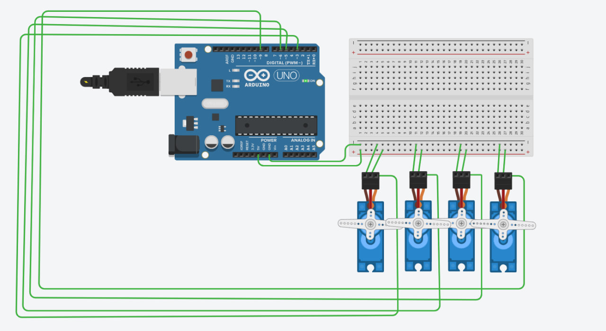
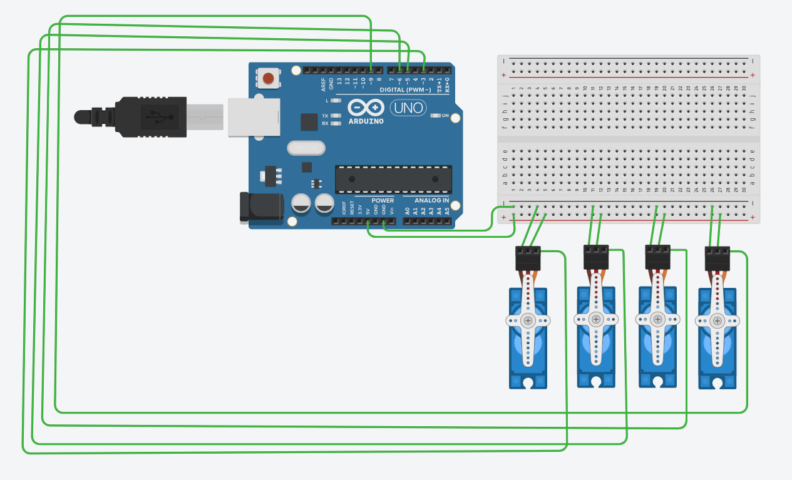

# Four Servo Motors Control System

## Project Overview

This project was developed using Arduino Uno and Tinkercad to control four servo motors simultaneously.

The system performs the Sweep motion for all four servo motors during the first 2 seconds. After that, all servo motors automatically stop and hold their position at 90°.

---

# Live Simulation for Tinkercad Project

https://www.tinkercad.com/things/8sVpnqrNNWt-foue-sevro-motors

---

# Task

Program four servo motors to perform the following actions:

- Perform the Sweep motion for 2 seconds.
- Stop automatically.
- Hold all servo motors at 90°.

---

# Components Used

- Arduino Uno R3
- Breadboard
- 4 × Servo Motors
- Jumper Wires

---

# Circuit Connections

| Servo Motor | Arduino Pin |
|--------------|-------------|
| Servo 1 | D3 |
| Servo 2 | D5 |
| Servo 3 | D6 |
| Servo 4 | D9 |

### Power Connections

- Red wires → 5V
- Brown wires → GND

---

# Screenshots

## Simulation (Sweep Motion)

---

## Final Position (90°)

---

# Arduino Code
#include <Servo.h>

Servo servo1, servo2, servo3, servo4;

void setup() {
  servo1.attach(3);
  servo2.attach(5);
  servo3.attach(6);
  servo4.attach(9);
}

void moveAll(int angle) {
  servo1.write(angle);
  servo2.write(angle);
  servo3.write(angle);
  servo4.write(angle);
}

void loop() {

  if (millis() <= 2000) {

    for (int angle = 0; angle <= 180; angle += 2) {
      moveAll(angle);
      delay(10);
    }

    for (int angle = 180; angle >= 0; angle -= 2) {
      moveAll(angle);
      delay(10);
    }

  } else {

    moveAll(90);

    while (true) {
    }

  }
}

---

# Project Result

- All four servo motors move together using the Sweep motion.
- The Sweep motion runs for 2 seconds.
- After that, all servo motors stop and hold at 90°.
- The project was successfully tested using Tinkercad.

---

# Files Included

- four_servo_motors.ino
- README.md
- screenshots/
  - Simulatioon.jpg
  - Simulatioof.jpg

---

# Author

Turki Alkhelaiwi

Smart Methods Summer Training
